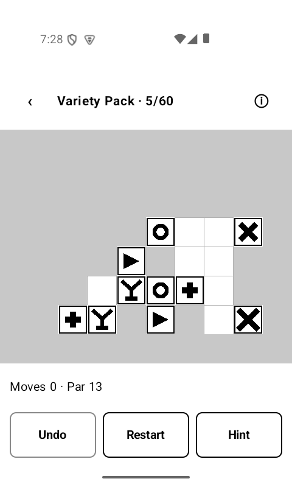

# kVexed


**Vexed** — the classic sliding-block puzzle — for the
[Mudita Kompakt](https://mudita.com/) e-ink phone (MuditaOS-K, AOSP,
**no Google Services**). Slide blocks into gaps, let gravity drop them, and clear
the board by matching two or more of a kind. Fully offline: **no network, no
permissions, no services.**



*Running on the Mudita Kompakt (800×480 e-ink).*

[](https://www.buymeacoffee.com/ok1cdj)

## What it does

- Classic Vexed on a fixed **10×8** board with eight block types. Move a block
  one cell left/right into an empty space; blocks fall; groups of ≥2 orthogonally
  adjacent same-type blocks clear simultaneously, which can chain.
- Bundles the original **Vexed level packs** (48 packs, 2800 puzzles), each with
  a par derived from the shipped human solution — golf your move count against it.
- **Unlimited undo**, restart, and a **hint** that reveals only the next move.
- Resumes exactly where you left off after the app is killed.
- Built for e-ink: pure 1-bit black/white, vector block glyphs, no animations,
  tap-to-move (no swipe).

## Level data & attribution

- Game: **Vexed** by James McCombe (1999). Classic II and the colour version by
  Steve Haynal and Mark Ingebretson (2001).
- Level data comes **solely** from the SourceForge **Vexed v2.2** distribution
  (2006-06-17), by the **Vexed Development Team**. That release bundles exactly
  **48 packs** — 9 canonical (Classic, Classic II, Variety, Variety II,
  Children's, Twister, Confusion, Panic, Impossible) plus Variety 3–41 — which is
  the complete set kVexed ships. After de-duplicating identical boards across
  packs, that's **2800** unique puzzles.
- One shipped solution (Classic II / *Greensboro*) was corrupt in the source; it
  was replaced with a solver-found solution (`tools/solve.py`) rather than
  dropped. Every such case is recorded in [`tools/known-bad.md`](tools/known-bad.md).
- Board/solution encoding: the **VXL** text format from
  [`dlvoy/flipper-zero-vexed`](https://github.com/dlvoy/flipper-zero-vexed), kept
  deliberately so custom packs stay portable between implementations.

## Regenerating the level data

The bundled levels in `core/src/main/resources/levels/` are generated (and
committed) — the converter never runs at build time. To regenerate from the
original Palm `.pdb` packs (kept in `tools/.cache/`, git-ignored):

```bash
python3 tools/pdb2vxl.py tools/.cache -o core/src/main/resources/levels
```

The converter verifies **every** shipped solution against the reference engine
and deduplicates identical boards across packs. A level whose shipped solution
fails verification is **never dropped silently**: it is printed, recorded in
`tools/known-bad.md`, and either replaced from `tools/solution-overrides.json`
(a solver-found solution, re-verified) or dropped-with-record. The run aborts
only on structural PDB errors.

`tools/solve.py` is a forward search solver (reusing the same engine) used to
find replacement and best-known solutions:

```bash
python3 tools/solve.py --pack core/src/main/resources/levels/01-classic-levels.vxl --level 0
python3 tools/solve.py --board "10/…/10" --max-depth 20
python3 tools/solve.py --selftest      # solves 5 Classic levels within par
```

## Build & install

Requires JDK 17+ (the Android Studio JBR works). The Android SDK path goes in
`local.properties` (copy from `local.properties.example`).

```bash
export JAVA_HOME=/opt/android-studio/jbr     # or any JDK 17+
./gradlew :core:test                          # engine oracle — replays every solution
./gradlew assembleDebug                       # app/build/outputs/apk/debug/app-debug.apk
./gradlew assembleRelease                     # signed release (needs keystore in local.properties)
```

Sideload the APK via **Mudita Center** (USB-C), WebADB, or `adb install`.
For release updates, always reuse the same keystore or installs fail with
"signatures do not match".

### Cutting a release

Locally, `scripts/build-release.sh` runs the tests, then builds a signed,
minified APK named `kvexed-<versionName>.apk` in the project root:

```bash
./scripts/build-release.sh
```

In CI, `.github/workflows/release.yml` runs the engine tests and attaches the
APK to a GitHub Release when a `v*` tag is pushed:

```bash
git tag v1.0 && git push origin v1.0
```

The workflow needs four repository secrets (Settings → Secrets and variables →
Actions), so the keystore never lives in the repo:

| Secret | Value |
|--------|-------|
| `KEYSTORE_BASE64` | `base64 -w0 keystore/kvexed.jks` |
| `KEYSTORE_PASSWORD` | store password |
| `KEY_ALIAS` | `kvexed` |
| `KEY_PASSWORD` | key password |

## Tuning knobs

All isolated to single constants:

- `ui/GameScreen.kt` — `CELL_SIZE_DP`, `GLYPH_INSET`, `BORDER_WIDTH`.
- `ui/BlockGlyphs.kt` — glyph stroke widths.
- `core/Engine.kt` — match-evaluation semantics switch (see the comment there).

## Architecture

```
core/  (pure Kotlin/JVM — no Android on the classpath)
  Board.kt         immutable 10×8 board over CharArray(80)
  Engine.kt        move -> settle -> clear (chains); win/lose; undo
  LevelParser.kt   reads index.json + *.vxl from resources
  Level/LevelPack  data classes
app/   (Android, depends on :core)
  ui/GameScreen    single Canvas, tap-to-move, no anti-aliasing
  ui/BlockGlyphs   8 vector Path glyphs
  ui/PackListScreen / LevelListScreen
  data/ProgressStore  DataStore Preferences, hand-serialized JSON
```

The engine lives in a **pure JVM module** so its 2800-solution oracle runs as a
plain `./gradlew :core:test` — no emulator, no Robolectric — and so the compiler
guarantees the game logic never touches an Android API.

## License

kVexed is licensed under **GPL-2.0** — see [`LICENSE`](LICENSE). The rest of the
"k" app family is GPL-3.0, but kVexed reuses level data from the original Vexed
(GPL-2.0), which forbids relicensing to a later version, so kVexed stays GPL-2.0.
